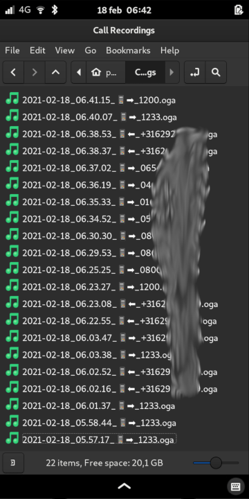

Call Recorder
===

Simple call recorder written for the PinePhone and other Linux phones.

Depends on ModemManager, Dbus, Pulseaudio, ffmpeg and probably more.

By default saves .oga files to `~/Call Recorder`. Well, default... There's not much configurability in here. Not UI at all.

I'll think about properly packaging it later. For now it's just a loose script.

## Installation ##

Put the files wherever you like. Edit `call-recorder.service` to point to the right place, then copy or symlink it to `~/.config/systemd/user/call-recorder.service` (create the directories if they doesn't exist yet).

Run `systemctl --user enable --now call-recorder.service` to start it now and automatically in the future.

Place a call to test. Try speaking loud and softly, and listen to the earpiece and loudspeaker.

Open your file manager and browse to `~/Call Recorder`. There should be one `.oga` file now.

You can check the logs via `journalctl -f --user --unit call-recorder`

## Limitations ##

For now, it only records microphone audio. Therefore the results are best wen using the speaker, not earpiece.
But with some manual post-processing, earpiece-audio can sometimes be usable.

I want to also record modem audio in seperate channels, but that needs more research.

It also sometimes misses the first 1~2 seconds of audio.

There is also no UI at all. No notifications, no dialogs to keep/disracd recordings, no settings. Not even a config file. This might also come later.

## Screenshot ##

